# Character Skin Transition Shader

Made with HLSL and ShaderGraph for the URP in **Unity 2021.3.10f1**

## Screenshots

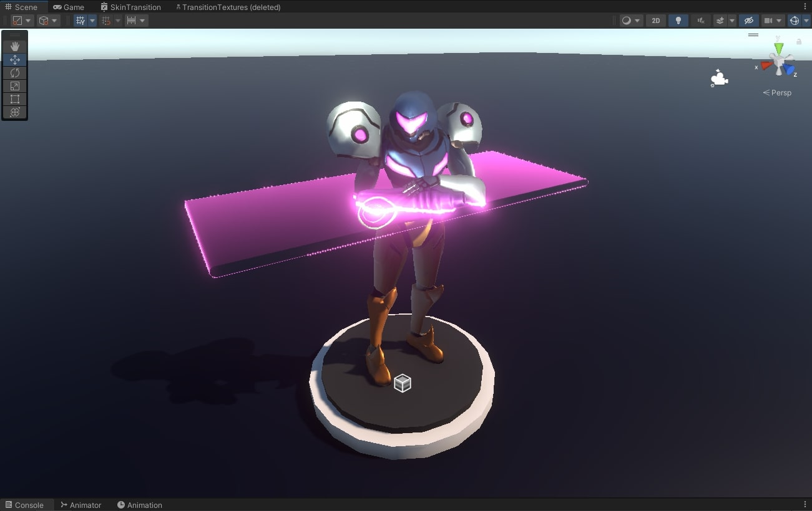

## Table of Content

- [Implementation](#implementation)
  - [Creating Alternative Textures](#creating-alternative-textures)
  - [Shader Graph](#shader-graph)
    - [HLSL Custom Function](#hlsl-custom-function)
    - [Sub Graph](#sub-graph)
    - [HDR](#hdr)
    - [Fresnel](#fresnel)
  - [C# Script](#c-script)

### References

- [Halloween Shader tutorial by Jettelly](https://www.youtube.com/watch?v=ZhIODmbX0OE)
- [HDR in Unity](https://docs.unity3d.com/Manual/HDR.html)
- [UnityObjectToWorldNormal in UnityCG](https://github.com/TwoTailsGames/Unity-Built-in-Shaders/blob/master/CGIncludes/UnityCG.cginc#L177)

## Implementation

### Creating Alternative Textures

- Using Affinity Photo, create alternative versions of the Albedo and Emission textures for the character.

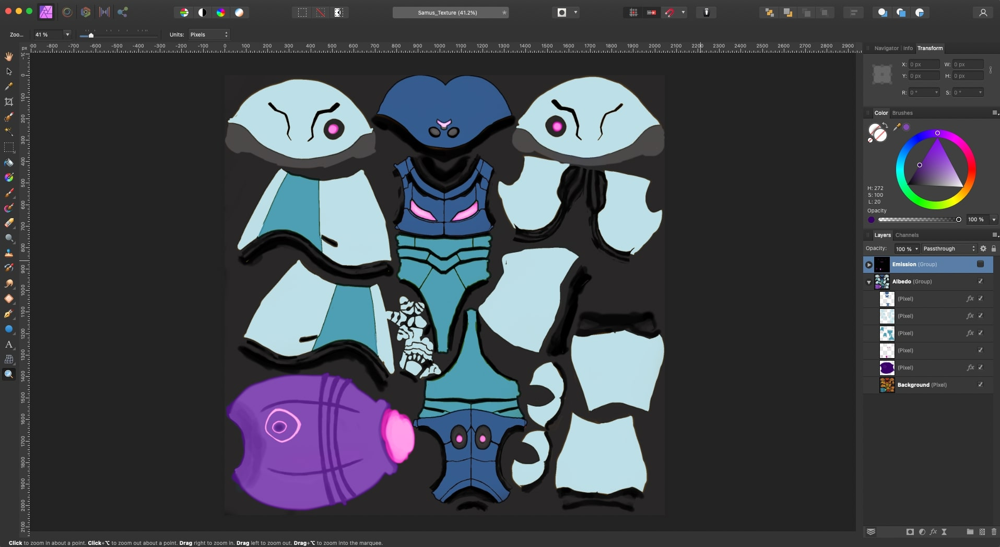
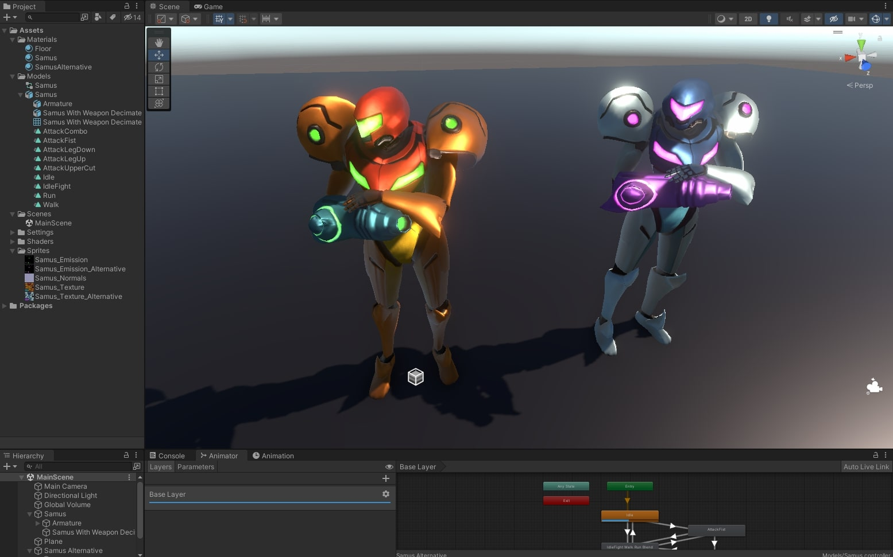

### Shader Graph

- Implement a **Lit Shader Graph** to render the surface of the character suit.
- Connect the **Albedo**, **Emission** and **Normal Map**.
- Implement a custom function that transitions between the two textures that define the different suits.

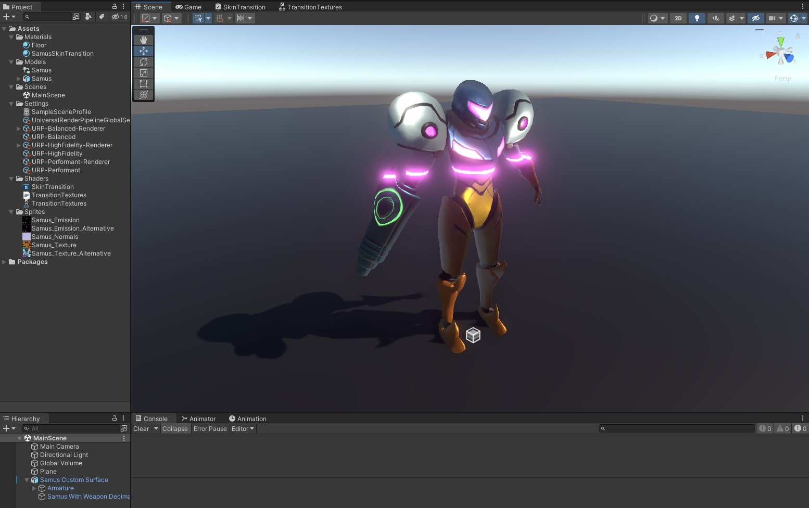
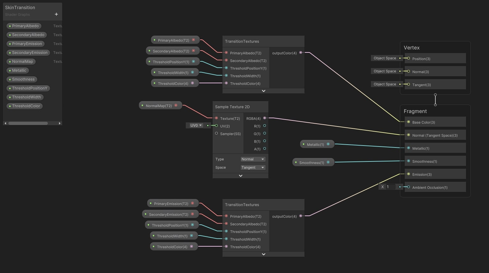

#### HLSL Custom Function

- Write a custom HLSL function that will transition between two given textures.
- It takes in both texels of both textures.
- Decides which texel to use based on a threshold position in world space.
- Comparing it against the fragment position in world spaces.
- This creates a vertical transition effect.
- The threshold also takes a parametrized color.

```hlsl
void TransitionTextures_half(
    in half4 primaryTextureColor,
    in half4 secondaryTextureColor,
    in float3 fragmentWorldPosition,
    in float thresholdWorldPositionY,
    in float thresholdWidth,
    in half4 thresholdColor,
    out half4 outputColor
)
{
    if(fragmentWorldPosition.y > thresholdWorldPositionY + thresholdWidth)
    {
        outputColor = secondaryTextureColor;
    } else if (
        thresholdWorldPositionY - thresholdWidth <= fragmentWorldPosition.y &&
        thresholdWorldPositionY + thresholdWidth >= fragmentWorldPosition.y)
    {
        outputColor = thresholdColor;
    } else
    {
        outputColor = primaryTextureColor;
    }
}
```

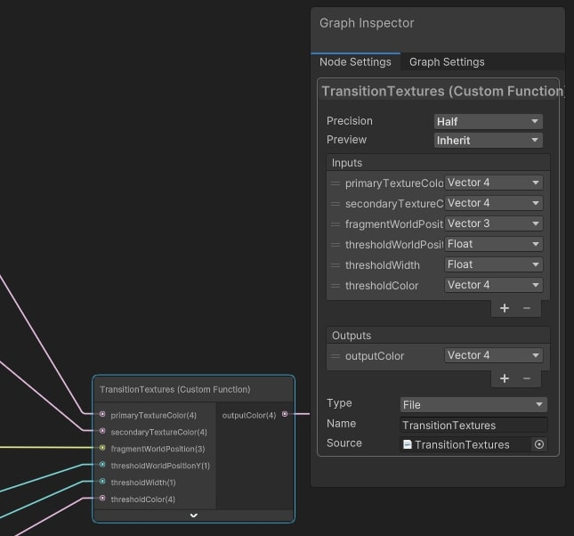

#### Sub Graph

- Use the **Custom HLSL Function** in a **Custom Function Node** in a Sub Graph.
- This sub graph will be reused for **Albedo** and **Emission**.
- Because we also need to transition the Emission to match the main texture change.

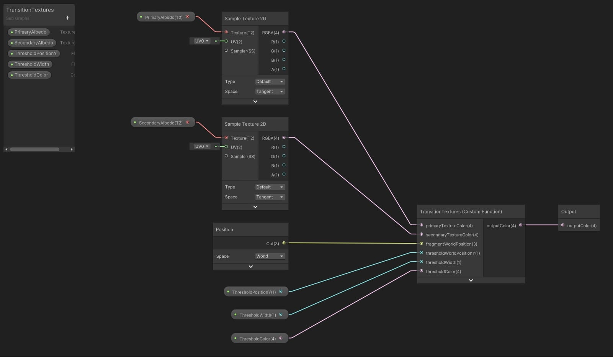

#### HDR

- Enable HDR in the URP Asset.
- Set the precision of the Color property to HDR.
- This enables a larger range of color intensity.
- The Bloom Post Processing effect will pick this up and create a Glow effect.

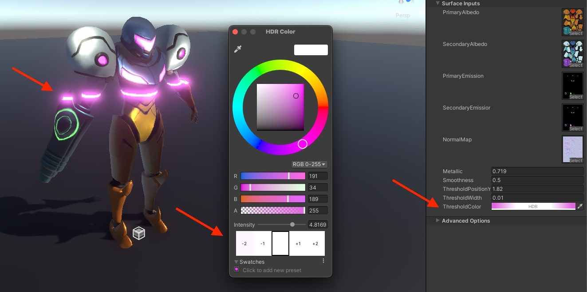
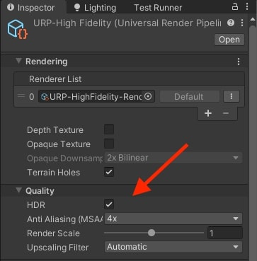

#### Fresnel

- Implement a simple unlit shader for a fresnel effect.
- Use HDR Color in Shader Lab.
- Use a simple transparency setup, by setting the RenderType and Queue to Transparent.
- Also setting ZWrite Off and the Blend command.
- Calculate the **viewDir** by getting the vector from the camera to the vertex in world space.
- Implement the Fresnel by doing the dot product between the normal in world space and the view dir.

```c
_FresnelPower ("Fresnel Power", Float) = 1
[HDR] _FresnelColor ("Fresnel Color", Color) = (1,1,1,1)
```

```c
Tags { "RenderType"="Transparent" "Queue"="Transparent" }
ZWrite Off
Blend SrcAlpha OneMinusSrcAlpha
LOD 100
```

```c
v2f vert (appdata v)
{
    v2f o;
    o.vertex = UnityObjectToClipPos(v.vertex);

    float4 worldPos = mul(unity_ObjectToWorld, v.vertex);
    o.viewDir = float4(_WorldSpaceCameraPos - worldPos.xyz, 0);

    o.worldNormal = UnityObjectToWorldNormal(v.normal);
    return o;
}

fixed4 frag (v2f i) : SV_Target
{
    // fresnelDot is zero when normal is 90 deg angle from view dir
    float fresnelDot = dot(i.worldNormal, normalize(i.viewDir));

    fresnelDot = saturate(fresnelDot); // clamp to 0,1
    float fresnelPow = pow(1.0f - fresnelDot, _FresnelPower );

    return fresnelPow * _FresnelColor;
}
```

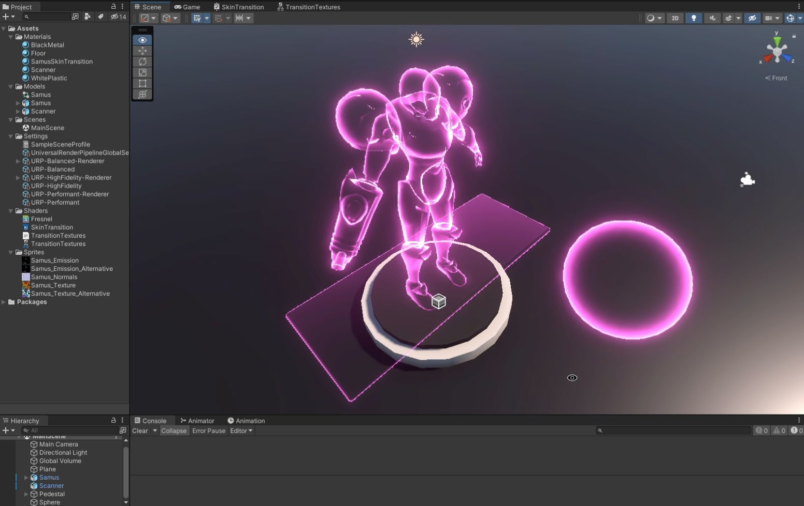

### C# Script

- On Update, pass the world position of the Scanner to the Shader.

```cs
[RequireComponent(typeof(SkinnedMeshRenderer))]
public class ThresholdPositionSetter : MonoBehaviour
{
    public Transform ThresholdObject;
    private Material _material;

    // Start is called before the first frame update
    void Start()
    {
        _material = GetComponent<SkinnedMeshRenderer>().material;
    }

    // Update is called once per frame
    void Update()
    {
        _material.SetFloat("_ThresholdPositionY", ThresholdObject.transform.position.y);
    }
}
```

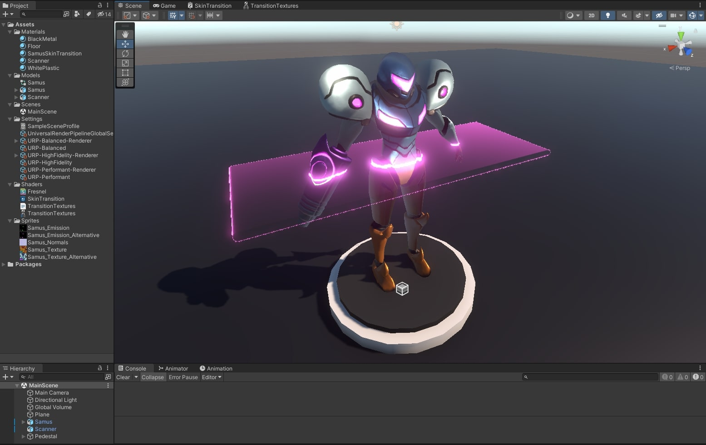
